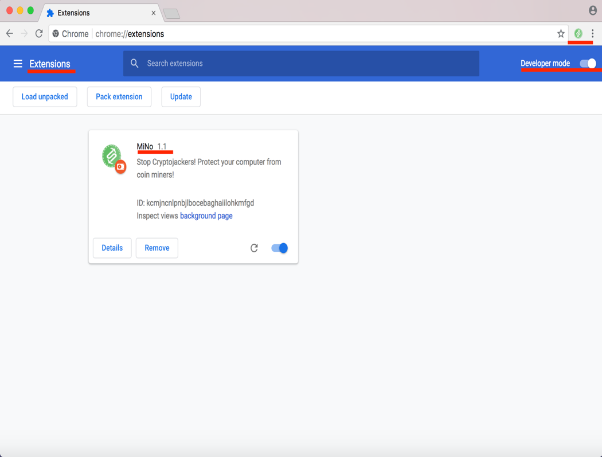
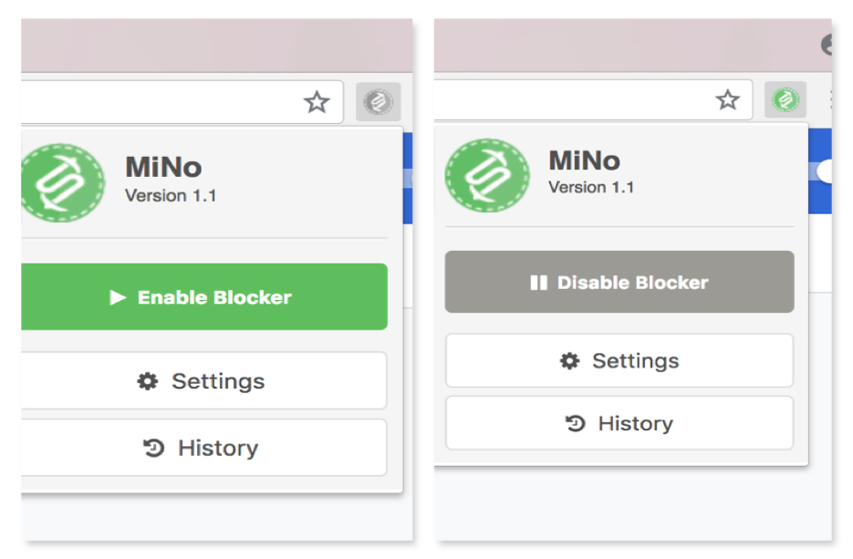
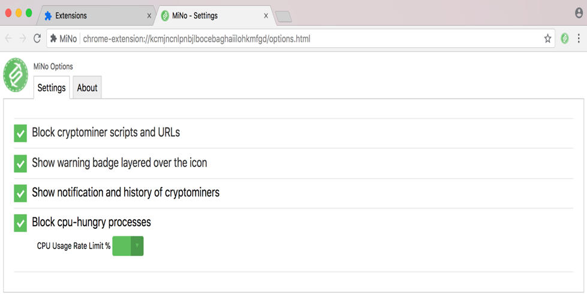
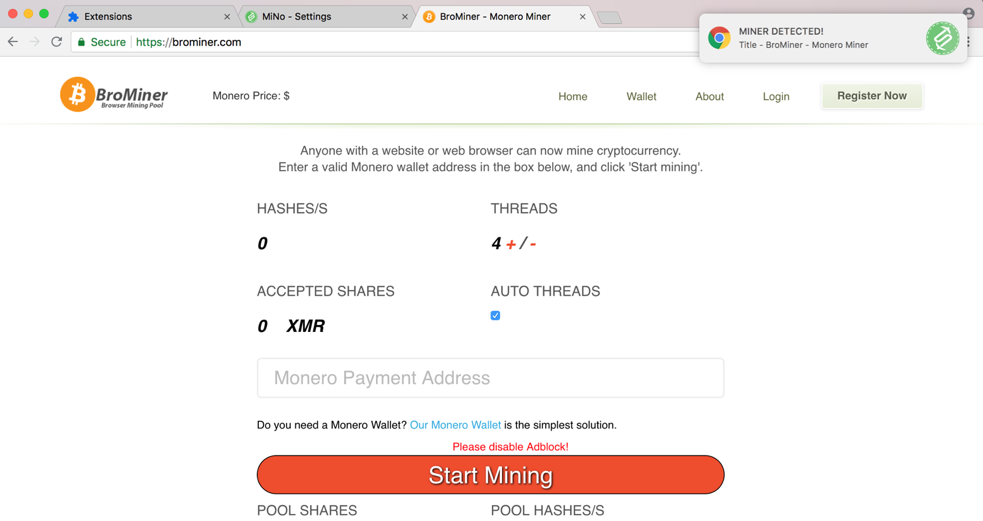
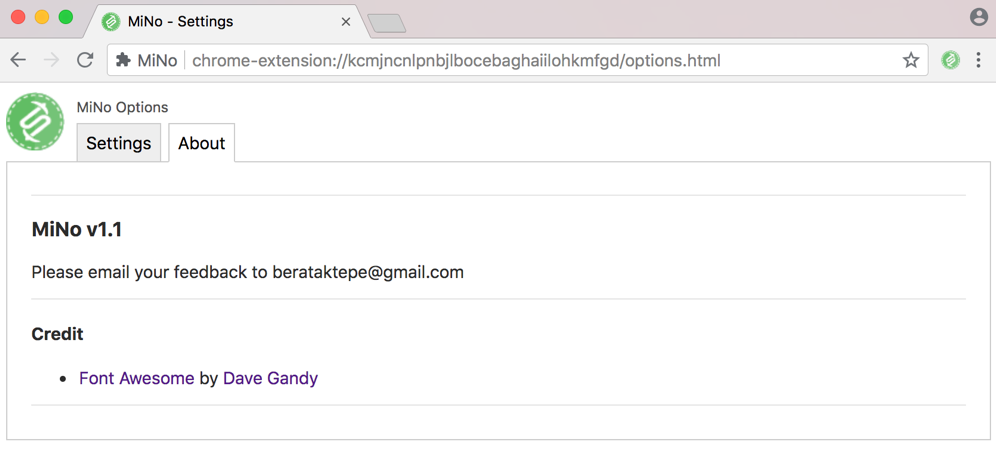
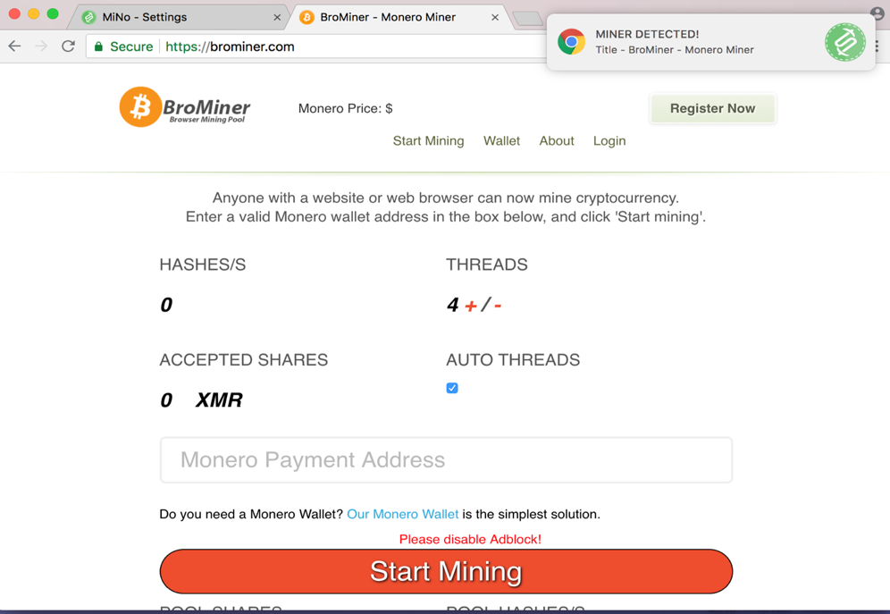
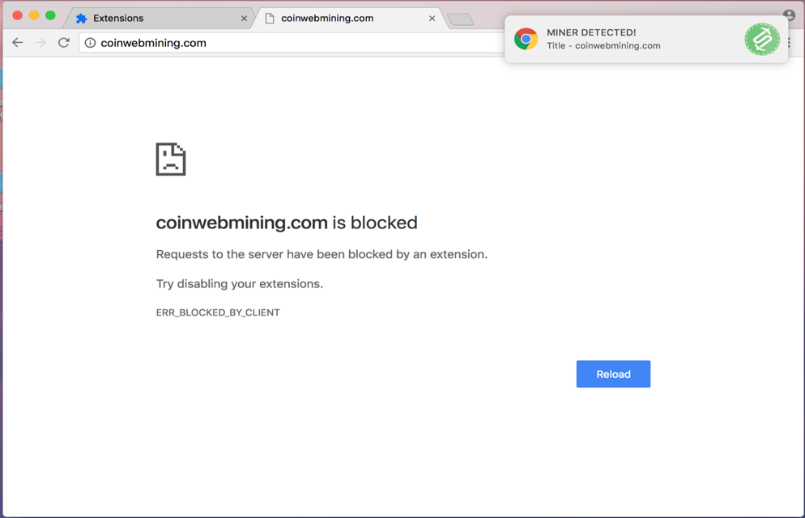

# MiNo (Mine No)

We named the extension as MiNo with the shortcut of words "Mine" and
"No". According to the many marketing researches; simple, short and easy
to remember names more likely to be remembered by user and preferred
over the long named competitors. In this case, we believe MiNo
will get ahead with short, phonetic and sympathetic name against
competitors such as NoCoin, NoMiner, CoinBlock etc.

## 4.1 Requirements and Installation

The add-on MiNo was developed and configured for Google Chrome
Developer Channel which is the newest version of Google Chrome web
browser. The reason for choosing the developer channel instead of the
stable channel is, currently CPU-usage control information can be
reached only in the developer channel and this is one of the main
function of MiNo to detect and block the malicious processes using
high percentage of CPU usage. However, these features provided in the
developer channel are expected to be available in the stable channel
in near future with the updates and newer versions of Chrome web
browser's stable channel.

MiNo has not been published to Chrome's extension market yet so it
needs to be manually installed. Users need to go to the Extensions
page on Chrome and activate the developer mode. Then the folder
contains source code files of MiNo can be dragged and dropped to the
Chrome browser to complete the installation. Once these steps
completed, icon will appear on the top right side of the browser and
MiNo will be ready to use.

## 4.2 Overview and Features

MiNo's icon will appear on the right top part of the Chrome web
browser within the installation. This is the default location of
Chrome web browser for extensions. When the MiNo\'s icon is clicked,
he starting page of MiNo will open on a popup page. Main controls of
he MiNo located in this popup page including enable/disable control,
settings where user can change the controls and history where
nformation and records of the detected or blocked incidents kept.
User can enable or disable the program anytime with clicking the icon
and use the enable/disable button on the popup page. This function is
useful when the user will voluntarily visit websites has cryptominer
or any page use higher CPU rate with the user's consent. MiNo can be
enabled back anytime user wishes without closing or reopening the
browser since Enable/Disable function works instantly.

## 4.2.1 Settings

MiNo provides flexible controls for users to personalize the controls
or their preferences to have better functionality. When the icon
clicked on the browser, popup page will open and at the bottom of the
popup page "Settings" button is displayed which allow users to reach
the controls page to check or change the controls. When the user
clicks the button, it takes user to a new page displaying the options
on a new tab on browser.

There are four main controls provided under settings. Controls listed
with a checkbox on the left side allowing user to enable or disable
the function by clicking the checkbox. Details, functions and working
principals of the MiNo on the background will be reviewed with details
in the next chapter. We will review the basic functionality of these
controls in this section.

First control is "Block cryptominer scripts and URLs". This option is
controlling the function of checking the malicious scripts and URLs
contain cryptominers from the blacklist. User can use the checkbox to
either enable or disable this function. If the user disable this
option then MiNo will not be blocking the website according to
malicious scripts and URLs instead, it will only be demanding on CPU
usage control function to protect the system. Details of this
protection mechanism works in the background will be explained in next
chapter.

The second option is "Show warning badge layered over the icon".
Checkbox allows user to enable or disable the option of having a badge
placement feature on the extension's icon on the top right of the
browser whenever a threat detected, which is one of the visual warning
systems of the program.

The third option is "Show notification and history of cryptominers".
This checkbox allows user to enable or disable the notifications
displayed whenever a threat detected or blocked which is the second
visual warning system. This option also allows user to log the history
of the threats detected or blocked in the history section which we
will review in the next chapter.

The last option is "Block CPU-hungry processes". This checkbox allows
user to enable or disable the function of checking and blocking the
processes using high CPU rate. This is the second layer of protection
of the MiNo and the main feature separating MiNo from the competitors
n the market. When MiNo is enabled, it is continuously communicating
with the task manager of the Chrome web browser to check the CPU usage
rate of the running processes and blocking the processes using higher
han the default or user preferred value set. There is a default
percentage rate set in the function for the CPU usage in the system
which is 80 however, the dropdown menu located under this last
checkbox allows user to change this value of CPU usage to be blocked.
Details and deep analysis of the mechanism will be reviewed in the
next chapter.

There is also another tab on the Settings page calls "About". This
page provides information including the version of the program,
contact information of the developer and credits.

## 4.2.2 History

MiNo is keeping the records of the detected threats with various
information. The page this information displayed can be reached from
the "History" button on the main popup page of the program. When user
clicks the button, a new page on a new tab will be opened to display
the records. There are four different information is being recorded
and displayed in this page such as "Date and Time", "Page Title",
"Page URL" and "Bad Script/Process". Date and time shows exact date
and time of the detection and all records ordered by this information
chronologically. Date is displayed in MM/DD/YYYY format and time is
displayed in HR:MN:SC AM/PM format. Page title provides the title and
Page URL provides the complete URL of the website where malicious
event detected. Last column calls Bad Script/Process provides the
information of the detected malicious script, URL or process. Records
will be held until it is cleared manually by the user. There is "Clear
History" button located on the top right of the history page. User can
click this button to clear the current records. History page can be
reached easily by clicking the MiNo icon and clicking the history
button anytime on the browser.

We reviewed the general details of the user interface and features of
the MiNo including installation, design, functions and user controls.
In the next chapter, we will review the details of the security
mechanism of the MiNo running on background.

## 4.3 Detection Mechanism (Background)

MiNo consists of two main mechanisms to detect the malicious processes
and protect the system resources from being used without the user's
consent. First mechanism is scanning the website user visiting to
check the malicious scripts and URLs from the blacklist. Second
mechanism is checking the CPU usage rate of each process running on
browser from the task manager to detect any malicious activity.

## 4.3.1 Blocking Malicious Scripts and URLs

MiNo collects the malicious cryptominer scripts and URLs from an
external file calls filters.txt inside the assets folder when it is
installed into the Chrome browser. These filters in the file have been
acquired from various resources including previous works and online
resources. Once the MiNo have collected the filters, it can access to
the resources and requests of the web page before opening the web page
using a special function "chrome.webRequest.onBeforeRequest" provided
by the Chrome API. This function allows MiNo to have enough time to
check the content before a web request is made by Chrome. Thereupon,
MiNo scans the resources of the web page to check if there is any
malicious script or URL. There are three possible results at this
point. If there is no malicious script or URL found, then web page
will be loaded regularly without any change or block by MiNo. If MiNo
detects only malicious script or scripts in the content, it would
continue to serve the web page to the user however, it will prevent
the malicious script from being included in the web request. Since the
script is not included in the web request, it cannot run on the
background. In this case, MiNo will only block the malicious content
and let the user to access the web page without any threat to computer
resources.

On the other hand, if MiNo detects any malicious URL, it will block
the whole web page and will not let user to access to the web page in
order to protect the system resources. While this process is running,
user is being informed by the notification and badge on the icon
depending on user preferences on settings. Also, as we mention in the
previous chapter, this control mechanism can be disabled from settings
without disabling the program itself.

## 4.3.2 Blocking Processes Using High CPU

Second mechanism is based on controlling the CPU usage rate of the
processes running on the Chrome web browser. MiNo controls the CPU
usage of the processes and blocks the malicious processes using higher
CPU rate than the set value. Hence, this is the biggest and most
important difference of MiNo from its competitors. All the competitors
in the market provide only script and/or URL scanning and consist of
single layer of protection while MiNo has two different mechanisms
work together to back up each other for a better protection. We will
review the details and functions providing the CPU usage control and
blocking mechanism below.

There is a separate process created in the background for each content
working on Chrome such as web pages and add-on applications and
various information including name, CPU usage, network usage etc. of
these processes can be accessed by task manager and Chrome API.
Currently this API support is only available on the Chrome Developer
Channel and this is the main reason for us to choose Chrome Developer
Channel for MiNo.

MiNo uses Chrome Process API actively on this mechanism. Since there
are many systems run in internet today with different kinds of CPUs
and these CPUs have different number of cores. Chrome processes can
use all the CPU cores, and each core usage is represented as a
percentage of the CPU usage. In other words, CPU usage can be between
0-800 range in a system with 8-core CPU while it can be 0-200 range in
a system with 2-core CPU. In this case, we first designed MiNo to
determine the number of the cores of CPU through the Chrome API and
use variable limit of the CPU usage rate accordingly. However, after
our detailed tests in both "known malicious websites" and "known clean
websites" this method did not work as efficient as planned. There were
many false-positive results appeared during the tests. At this point,
we redesigned the CPU usage control function with a single set value
regardless of the number of CPU cores. After a careful review of the
experiment and test results we determined the optimum value for the
limit is 80%. However, users can still adjust the default value of
limit of high CPU usage from the settings page. Tests with lower
values had too many false positives and harmless processes like
YouTube blocked by MiNo. In fact, even with the current settings, some
harmless processes using high CPU rate can be blocked by MiNo. In
order to prevent this, MiNo uses a 10 second continuous control to
detect harmful processes over the harmless ones.

All processes that are actively running in Chrome are listened on the
background and the CPU usage is controlled every time the resource
usage of the processes is updated. If any process momentarily exceeds
the limit of high CPU usage, MiNo marks this process as suspicious and
starts to watch it for 10 seconds. MiNo calculates the average of CPU
usage rate of these 10 second period and if this average value is over
80% then this process is marked as harmful and blocked. User will be
notified with either badge over the icon and/or popup notification
according to the preferences. MiNo also keeps records of the blocked
processes in the history page with details.

Another feature of the MiNo in this mechanism is, once a process using
high CPU is blocked is also recorded in the CPU hungry process list on
the background, and whenever the same process is created again, it
will be blocked instantly. One of the greatest feature of MiNo in this
mechanism is it will control not only the web pages but also add-ons.
Whenever an extension is installed and run on Chrome by the user,
there will be a process created for this extension. Since MiNo
controls all the running processes regardless of the type, in case if
there is any malicious software exist in the extension will be blocked
by MiNo due to high CPU usage. However, Google recently filtered and
removed most of the harmful extensions from the Chrome market hence we
could test this feature on only one add-on in experiment section for
now.

## License

(c) Copyright Safa Berat AKTEPE 2018-2019.
